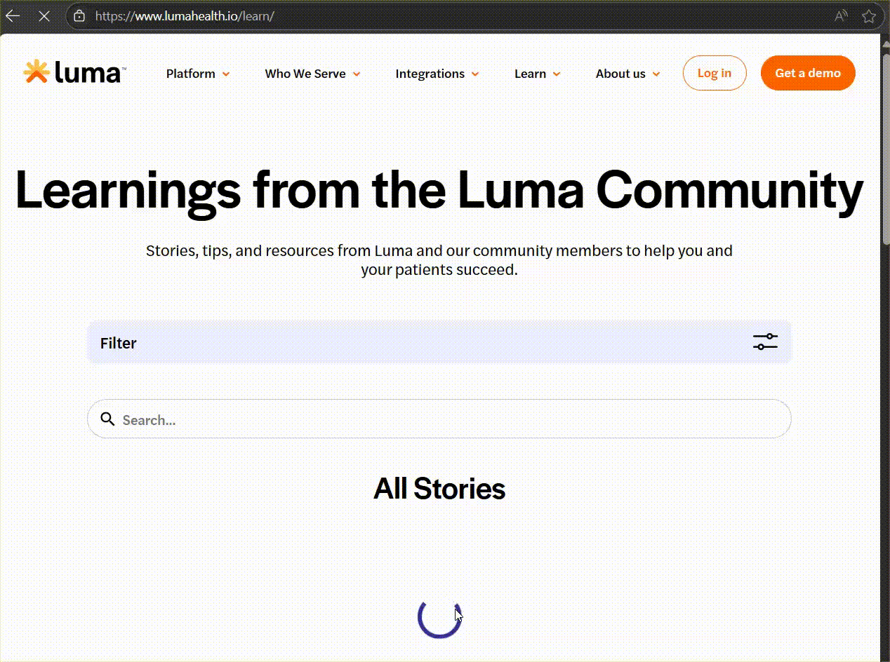

# 📘 Luma Health - sample project

This project contains sample end-to-end and responsiveness automated tests for the [luma](https://www.lumahealth.io/) using [Cypress](https://www.cypress.io/) and releasing [report](https://lukkasmatteus00.github.io/luma-health-ui-tests/) online.

---

## 📁 Project Structure

```
luma-health-ui-tests/
│
├── cypress/
│   ├── e2e/                    # End-to-end test scenarios
│   ├── responsiveness/         # Responsiveness tests
│   ├── fixtures/               # Static test data (JSON)
│   ├── support/
│   │   ├── commands/           # Custom Cypress commands
│   │   ├── e2e.js              # Global setup
│   └── suites.json             # Suite-to-folder mapping
│   └── runner.js               # Script to run tests via terminal with params
│
├── cypress.config.js           # Cypress configuration
├── package.json                # Project metadata and dependencies
└── README.md                   # Project documentation
```
---

## 🚀 Getting Started

### 1. Clone the Repository

```bash
git clone https://github.com/lukkasmatteus00/luma-health-ui-tests.git
cd luma-health-ui-tests
```

### 2. Install Dependencies

Make sure you have [Node.js](https://nodejs.org/) installed. Then run:

```bash
npm install
```

---

## 🧪 Running Tests

### Option 1: Interactive mode (GUI)

```bash
npx cypress open
```

### Option 2: Headless mode (default browser: Electron)

```bash
npx cypress run
```

### ✅ Option 3: Custom CLI with suite, browser and headless options

It's was created a custom test runner script located at `cypress/runner.js`. It allows running tests by passing parameters via terminal.

#### ✅ Syntax:

```bash
npm run test <SUITE>[:headless][:browser]
```

| Parameter     | Description                              | Required | Example             |
|---------------|------------------------------------------|----------|----------------------|
| `SUITE`       | Test suite (based on `suites.json`)      | ✅ Yes   | `mobile`, `e2e`, `404`        |
| `headless`    | Optional flag to run headless            | ❌ No    | `nh` or `headless`   |
| `browser`     | Optional browser (`-ff`, `-edge`, `-electron`, `-chrome`) | ❌ No | `-ff`                |

#### ✅ Examples:

```bash
# Run responsiveness tests in Firefox (headed)
npm run test tablet:-ff

# Run E2E tests in Chrome (headless)
npm run test e2e:-chrome:nh
```

> 💡 `suites.json` maps suite names to folders. For example:
```json
{
  "e2e":"e2e/**/*",
  "404":"e2e/404Page.spec.js",
  "mobile":"responsiveness/mobile.spec.js"
}
```

---

## 📦 Dependencies

Main tools and frameworks used:

- [Cypress](https://www.cypress.io/)
- [Faker](https://v9.fakerjs.dev/guide/)
- [Mocha](https://mochajs.org/)
- [Mochawesome](https://www.npmjs.com/package/mochawesome)
- [Node.js](https://nodejs.org/)

---

## 🤝 Final Considerations & Contributing

While creating the tests, I tried to keep things simple. I didn’t use any design patterns like Page Object, App Actions, Factory Pages, or Cucumber, because for a sample project I felt they would just add unnecessary complexity. So, I stuck with plain Cypress, focusing on simplicity, clean code, maintainability, and scalability if extra steps were needed. The only added complexity was a runner file, which I think is useful to make CLI execution easier. It allows dynamic selection of the spec, viewport, and browser, but you can still run tests using the standard Cypress setup, the runner is more of a helpful addition than a restriction.

A few things I wanted to highlight:

* There seems to be an issue on the `/learn` page with small viewports, causing an endless loading loop. This was noticed while developing the project and can be seen when running tests in `tablet` view. (e.g)

* Most elements don’t have `data-cy` or `data-test-id` attributes. Adding them would make it much easier to map elements for automation and prevent tests from breaking if the DOM structure changes.
* Honestly, tests take a bit of time to run completly because the landing pages takes time load fully. Some strategies were used to improve performance a little, like using `{ waitUntil: "domcontentloaded" }` propety.
* The demo form wasn’t fully tested because of the captcha.

Overall, it was fun to work on this project and think of strategies that could add value, like using dependencies to interact with iframes, creating the runner file, etc.

If you have any questions or need further clarification, feel free to reach out.

---